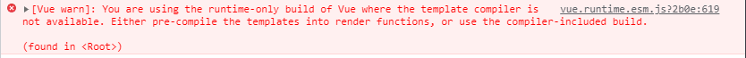
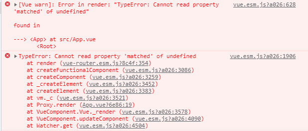

### Bug-1 You are using the runtime-only build of Vue where the template compiler is not available.


解决办法
创建vue.config.js
```
module.exports = {
  runtimeCompiler: true
}
```


### Bug-2 Error in render TypeError Cannot read property 'matched' of undefined


解决办法

名字必须是 router
```
import Vue from 'vue'
import App from './App.vue'
import router from './router.js'

Vue.config.productionTip = false

new Vue({
  el: '#app',
  router,
  render: h => h(App)
})
```